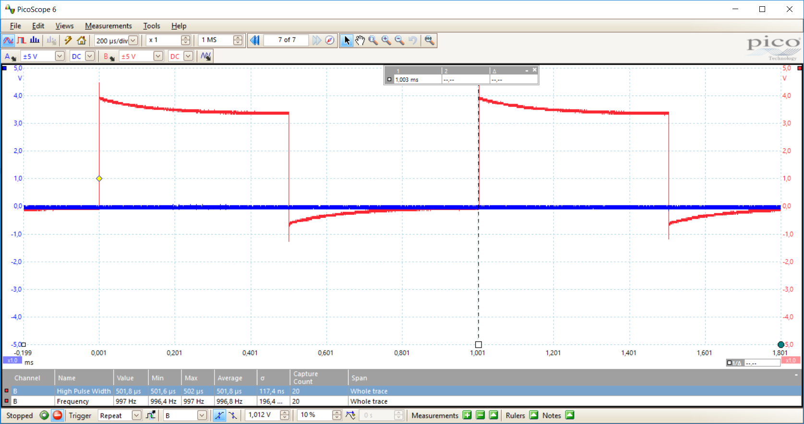
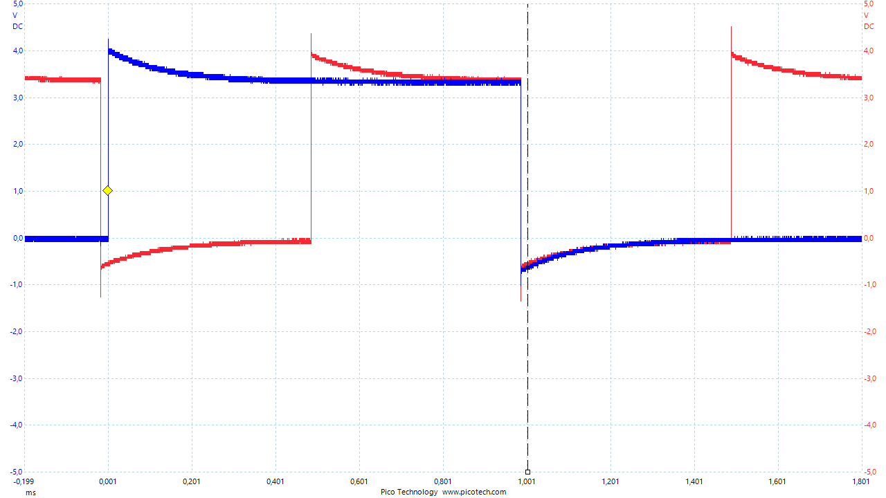
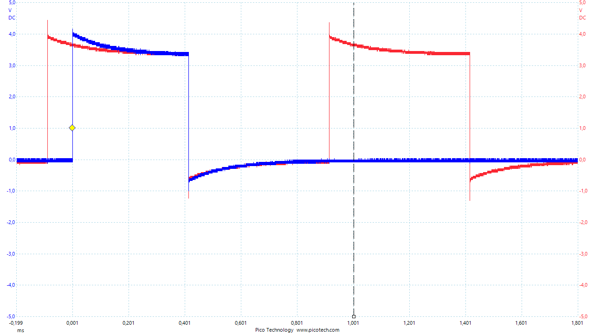

---
enable mksocfpga uio_irq

---

Added mini version of mesaflash tool called:

mksocmemio

[this utility can read or write the mksocfpga hostmot2 registers](../SW/MK/mksocmemio/)

Memory layout Here:

[HostMot2 Register map](http://freeby.mesanet.com/regmap)

	usage:
	read: 	mksocmemio -r [address in hex]
	write: 	mksocmemio -w [ address in hex] [value in decimal]

---

Added utility to count and display number of uio0 interrupts:

uio_test

[this utility counts and displays the number of uio0 interrupts occured](../SW/MK/uio_irq_test/)

	sudo ./uio_test &

to remove:

	sudo pkill uio_test

---

Partly Unresolved for debian-8.4-machinekit-de0-armhf-2016-04-27-4gb.img: (due to u-boot variable issues)
(current fix is to install my own u-boot 2016.03, reset env variables to default rename Vmlinux-4.xxx to zImage(after installing the 4.1 kernel .debs), and copy kernel built .dtb to /boot/socfpga.dtb)

Making hm2reg-uio-dkms driver obsolete:

Inspired from here:

[Handling GPIO interrupts in userspace on Linux with UIO](https://yurovsky.github.io/2014/10/10/linux-uio-gpio-interrupt/)

First remove all custom hm2 soc uio driver instances:

	sudo dkms remove hm2reg_uio/0.0.2 --all
	sudo apt purge hm2reg-uio-dkms

Then install 4.1 kernel:

	sudo sh -c 'echo "deb [arch=armhf] https://deb.mah.priv.at/ jessie socfpga" > /etc/apt/sources.list.d/debmah.list'
	sudo apt-key adv --keyserver keyserver.ubuntu.com --recv 4FD9D713
	sudo apt update
	sudo apt upgrade -y

Enable Devicetree overlay functionality:

	sudo sh -c 'echo "/sys/kernel/config /config         none    bind                      0 0" >> /etc/fstab'

reboot by shutdown logout and powercycling.(to be sure the fpga is unconfigured on boot)

	sudo shutdown now & logout

wait 15 sek or so or until usb serival console reads:

	[  OK  ] Reached target Shutdown.
	System halted.

test by setting uio_pdrv_genirq parameter manually:

	sudo modprobe -r uio_pdrv_genirq
	sudo modprobe uio_pdrv_genirq of_id="hm2reg_io,generic-uio,ui_pdrv"

Use this to set permantly on boot:

	sudo sh -c 'echo options uio_pdrv_genirq of_id="hm2reg_io,generic-uio,ui_pdrv" > /etc/modprobe.d/uiohm2.conf'

---

Dts:

[Remember to recompile the new changed device tree overlay fragment:](../SW/MK/dts-overlays/hm2reg_uio-irq.dts)

note: compatible string is replaced with:

	compatible = "hm2reg_io,generic-uio,ui_pdrv";

make sure you have dtc v1.4.1+:

	dtc --version

compile:

	dtc -I dts -O dtb -o hm2reg_uio.dtbo hm2reg_uio-irq.dts

copy:

	sudo cp hm2reg_uio.dtbo /lib/firmware/socfpga/dtbo/hm2reg_uio.dtbo

---

Run machinekit:
(First I need to update the Machinekit sources and rebuild machinekit)

	cd machinekit
	git pull
	make clean
	sh autogen.sh
	./configure --with-rt-preempt --with-platform-socfpga
	make

if this message appears --> virtual memory exhausted: Cannot allocate memory

	make OPT=-O0 -j1

	sudo make setuid

[use hm2_soc mk config with the hm2_soc_ol driver like in this example config:](./test-configs/hm2-soc-stepper-cramps)

	[HOSTMOT2]
	DRIVER=hm2_soc_ol
	BOARD=5i25
	CONFIG="firmware=socfpga/dtbo/hm2reg_uio.dtbo num_encoders=2 num_pwmgens=2 num_stepgens=10"

---

Note: this config will be move to Machinekit/Machinekit repo shortly...

To download hm2-soc-stepper-cramps hal config for testing:

You can download a folder form a github repo by using subversion, and replacing the tree/master/ part in the url with /trunk

	sudo apt install subversion
	cd machinekit/configs
	svn checkout https://github.com/the-snowwhite/mksocfpga/trunk/docs/test-configs/hm2-soc-stepper-cramps

or

	svn checkout https://github.com/machinekit/mksocfpga/trunk/docs/test-configs/hm2-soc-stepper-cramps

to run:

	machinekit ~/machinekit/configs/hm2-soc-stepper-cramps/5i25-soc.ini

---

in separate console:

start uio interrupt count readout:

	sudo ./uio_test &

		machinekit@mksocfpga:~$ sudo ./uio_test &
	[1] 3177

To end afterwards:

	sudo pkill uio_test

---

set period to roughly 1ms (1kHz)

and enable timer 1 interrupt:

	sudo ./mksocmemio -w 7200 211812352
	sudo ./mksocmemio -w a00 2

shows:

	machinekit@mksocfpga:~$ sudo ./mksocmemio -w 7200 211812352
		mksocfpgamemio: read write hm2 memory locatons by cmmandline arguments
		/dev/uio0 opened fine OK
		region mmap'ed  OK
		mem pointer created OK
	Program name: ./mksocmemio    input option = w
	read Write read
	Address 29184   value = 436175482
	Address 29184   former val = 0x19FF827A          wrote: --> 0x0CA00000   read: = 0x0CFA0000

	machinekit@mksocfpga:~$ sudo ./mksocmemio -w a00 2
		mksocfpgamemio: read write hm2 memory locatons by cmmandline arguments
		/dev/uio0 opened fine OK
		region mmap'ed  OK
		mem pointer created OK
	Program name: ./mksocmemio    input option = w
	read Write read
	Address 2560    value = 1
	Address 2560    former val = 0x00000001          wrote: --> 0x00000002   read: = 0x00000002
	Interrupt #2!

dec 211812352 = 0xCB00000 hex

waveform on dpll pin (red)

---

reset interrupt:

	sudo ./mksocmemio -w b00 0

shows:

	machinekit@mksocfpga:~$ sudo ./mksocmemio -w b00 0
		mksocfpgamemio: read write hm2 memory locatons by cmmandline arguments
		/dev/uio0 opened fine OK
		region mmap'ed  OK
		mem pointer created OK
	Program name: ./mksocmemio    input option = w
	read Write read
	Address 2816    value = 131071
	Address 2816    former val = 0x0001FFFF          wrote: --> 0x00000000   read: = 0x0001FFFF
	Interrupt #3!

2 waveform examples on intirq pin (blue)

note:  int signal goes high(inactive) at random time (press enter), and goes low (irq trigger) when dpll signal falls low.

---

----> references:

Generating clock interrupts from Mesanet cards:
https://github.com/mhaberler/asciidoc-sandbox/wiki/Generating-clock-interrupts-from-Mesanet-cards

Installing the Machinekit SOCFPGA test image for the Terasic DE0-Nano-SoC Kit
https://gist.github.com/mhaberler/89a813dc70688e35d8848e8e467a1337

Handling GPIO interrupts in userspace on Linux with UIO:
https://yurovsky.github.io/2014/10/10/linux-uio-gpio-interrupt/

Howard Mao
Exploring the Arrow SoCKit Part X - Sending and Handling Interrupts:
https://zhehaomao.com/blog/fpga/2014/05/24/sockit-10.html

Setting up a device tree entry on Altera’s SoC FPGAs:
http://xillybus.com/tutorials/device-tree-altera-soc-cyclone

Dynamic Kernel Module Support:
https://wiki.archlinux.org/index.php/Dynamic_Kernel_Module_Support

pread and pwrite not defined?:
http://stackoverflow.com/questions/12411942/pread-and-pwrite-not-defined

http://stackoverflow.com/questions/16178876/c-implicit-declaration-of-function
